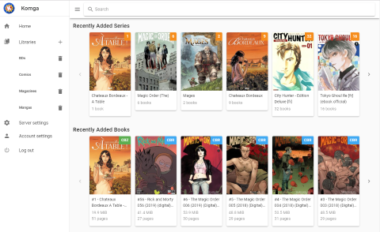
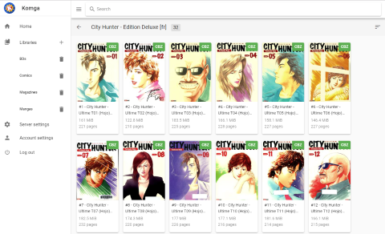
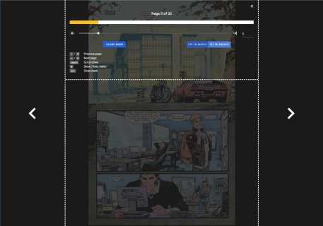
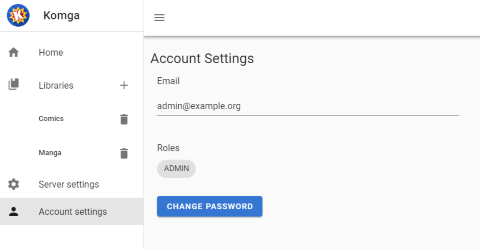
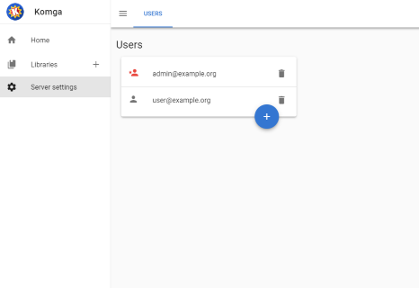
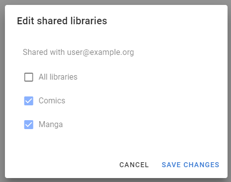

[](https://travis-ci.com/gotson/komga)
[](https://github.com/gotson/komga/releases)
[](https://hub.docker.com/r/gotson/komga)

#  Komga

Komga is a free and open source comics/mangas server.

## Features

Features include:

- scan and index libraries (local folders) containing sub-folders with comic book archives in `cbz` and `cbr` format, as well as `pdf`. Rescan periodically.
- API to serve the individual pages of those books. It can convert pages to different image format on the fly.
- API to serve the complete file for download
- OPDS feed
- web interface
- web reader
- user management, with per-library access control

## Installation

### Docker

The easiest way to run Komga is via Docker. Please refer to the ([instructions on how to use the image](https://hub.docker.com/r/gotson/komga)).

### Jar file

Alternatively you can run it from the fat `jar` file. You can find them in the [releases](https://github.com/gotson/komga/releases) section.

In order to run Komga, use the following command:

```
java -jar komga-x.y.z.jar
```

Note that you **need** to have a valid `application.yml` configuration file (or environment variables) for Komga to run properly, read on to the next section to find out more.

## Configuration

Komga relies heavily on [Spring Boot's configuration](https://docs.spring.io/spring-boot/docs/current/reference/html/boot-features-external-config.html), leveraging `profiles` and configuration `properties`.

The easiest way to configure is either via environment variables (a good fit for `docker-compose`) or by using an `application.yml` file located in the same folder as the `jar` file.

You can check sample `application.yml` files for [Windows](./doc/sample-configuration/windows/application.yml) and [Unix/Linux](./doc/sample-configuration/unix/application.yml).

Each configuration key can have a different format depending if it's from the environment variable, or from the `application.yml` file. In the following section I will provide both format in the form `ENVIRONMENT_VARIABLE` / `application-property`.

### Mandatory configuration

In order to make Komga run, you need to specify some mandatory configuration keys (unless you use Docker, in which case defaults are setup):

- `SPRING_PROFILES_ACTIVE` / `spring.profiles.active`: `prod` - this will enable the database management and upgrades for new versions.
- `SPRING_DATASOURCE_URL` / `spring.datasource.url`: the path of the database file. For Docker I use `jdbc:h2:/config/database.h2`, where `/config/database.h2` is the actual file inside the docker container. You can customize this part if running without docker.

### Optional configuration

You can also use some optional configuration keys:

- `KOMGA_LIBRARIES_SCAN_CRON` / `komga.libraries-scan-cron`: a [Spring cron expression](https://docs.spring.io/spring/docs/current/javadoc-api/org/springframework/scheduling/support/CronSequenceGenerator.html) for libraries periodic rescans. `0 0 * * * ?` will rescan every hour. `0 */15 * * * ?` will rescan every 15 minutes. Defaults to `0 */15 * * * ?` in `prod` profile.
- `KOMGA_THREADS_ANALYZER` / `komga.threads.analyzer`: the number of worker threads used for analyzing books. Defaults to `2`. You can experiment to get better performance.
- `KOMGA_LIBRARIES_SCAN_DIRECTORY_EXCLUSIONS` / `komga.libraries-scan-directory-exclusions`: a list of patterns to exclude directories from the scan. If the full path contains any of the patterns, the directory will be ignored. If using the environment variable form use a comma-separated list.
- `KOMGA_FILESYSTEM_SCANNER_FORCE_DIRECTORY_MODIFIED_TIME` / `komga.filesystem-scanner-force-directory-modified-time`: if set to `true`, it will force the last modified time of a directory as the maximum from its own last modified time and the last modified time from all the books inside the directory. This should be used only if your filesystem does not update the last modified time of a directory when files inside it are modified (Google Drive for instance).   

## What does it do?

Komga will scan your libraries for directories containing supported files (at the moment `cbz`, `zip`, `cbr`, `rar` and `pdf`):

- each folder containing comic books will be made as a `Series`
- each comic book file inside a `Series` will be made as a `Book`

It works with sub-folders too, so if you have a structure like this:

```
Comics/
├── Private Eye/
│   ├── Volume 1.cbz
│   └── Volume 2.cbz
└── One Shot.cbz
```

Komga will generate:

- a `Series` called _Comics_, containing a `Book` called _One Shot_
- a `Series` called _Private Eye_, containing two `Book`s called _Volume 1_ and _Volume 2_

On rescans, Komga will update Series and Books, add new ones, and remove the ones for which files don't exist anymore.

Then it will _analyze_ each book, which consist of indexing pages (images in the archive), and generating a thumbnail.

## Security

### User accounts

At startup, if no user account exists in database, Komga will generate an initial administrator account with a random password, and will output the login and password in the logs:

```
2019-10-15 17:15:31.483  INFO 18808 --- [  restartedMain] o.g.k.i.scheduler.InitialUserController  : Initial user created. Login: admin@example.org, Password: 2Qf8l85xOB8o
```

:exclamation: It is strongly advised to create your own account, and delete the generated account!

### HTTPS

If you want to open your Komga server outside your local network, it is strongly advised to secure it with `https` (especially due to the use of http basic authentication).

Spring Boot supports `https` out of the box, but you will have to configure it, and `https` is most useful only with valid certificates (not self-signed), which most people don't readily have available.

I recommend using [Caddy](https://caddyserver.com/) as a reverse proxy, as it supports the automatic generation of [Let's Encrypt](https://letsencrypt.org/) certificates.

## Clients

### Tachiyomi

Komga has an official extension for [Tachiyomi](https://github.com/inorichi/tachiyomi), available from within Tachiyomi's extension menu.
The extension is configurable, you need to specify the `server address`, `username`, and `password`.


### OPDS readers

Komga should work with any OPDS reader, unfortunately most readers badly implement the OPDS protocol :disappointed:.

Here is a list of reader applications I have tested:

| OS      | App name                                                                                                             | Status                                                                                                   | OpenSearch support | Page streaming support |
|---------|----------------------------------------------------------------------------------------------------------------------|----------------------------------------------------------------------------------------------------------|--------------------|------------------------|
| Android | [FBReader: Favorite Book Reader](https://play.google.com/store/apps/details?id=org.geometerplus.zlibrary.ui.android) | :x: Can't download CBR/CBZ, only PDF. PDF only supported in Premium version. Does not remember password. | No                 | No                     |
| Android | [Moon+ reader](https://play.google.com/store/apps/details?id=com.flyersoft.moonreader)                               | :x: Cannot download files. Does not remember password.                                                   | No                 | No                     |
| Android | [Librera](https://play.google.com/store/apps/details?id=com.foobnix.pdf.reader)                                      | :heavy_check_mark:                                                                                       | No                 | No                     |
| Android | [PocketBook](https://play.google.com/store/apps/details?id=com.obreey.reader)                                        | :x: Doesn't show CBR/CBZ                                                                                 | No                 | No                     |
| iOS     | [KyBook 3](http://kybook-reader.com/)                                                                                | :heavy_check_mark:                                                                                       | **Yes**            | No                     |
| iOS     | [Chunky Comic Reader](http://chunkyreader.com/)                                                                      | :heavy_check_mark:                                                                                       | No                 | **Yes**                |

Feel free to report your findings with other readers (by sending a PR)!

## Web interface

The web interface is available on port `8080`.

### Features

- browse libraries, series, and books
- search series and books
- download book file
- add and remove libraries (for administrators only)
- server settings (for administrators only)
    - users management (add and remove user, edit user's shared libraries access)
- account settings
    - change password

### Screenshots

|Home page | Browse Series |
|---|---|
| [](https://raw.githubusercontent.com/gotson/komga/master/.github/readme-images/webui-dashboard.png) | [](https://raw.githubusercontent.com/gotson/komga/master/.github/readme-images/webui-browse-series.png) |

|Web reader | Web reader menu |
|---|---|
| [](https://raw.githubusercontent.com/gotson/komga/master/.github/readme-images/webreader.png) | [](https://raw.githubusercontent.com/gotson/komga/master/.github/readme-images/webreader-menu.png) |


| Account settings | Users management | User rights |
|---|---|---|
| [](https://raw.githubusercontent.com/gotson/komga/master/.github/readme-images/webui-account-settings.png) | [](https://raw.githubusercontent.com/gotson/komga/master/.github/readme-images/webui-settings-users.png) | [](https://raw.githubusercontent.com/gotson/komga/master/.github/readme-images/webui-settings-users-libraries.png) |

## APIs

Default port for APIs is `8080`.

### Native API

Komga offers a REST API, which you can browse using Swagger. It's available at `/swagger-ui.html`. The API offers __file download__ and __page streaming__.

In order to access the API, you will need to authenticate using Basic Authentication.

### OPDS

Komga offers a standard OPDS feed, it is available at `/opds/v1.2/catalog`.

The OPDS feed also supports:

- OpenSearch functionality, to search by `Series`
- [OPDS Page Streaming Extension 1.0](https://vaemendis.net/opds-pse/) 

## Credits

The Komga icon is based on an icon made by [Freepik](https://www.freepik.com/home) from www.flaticon.com
