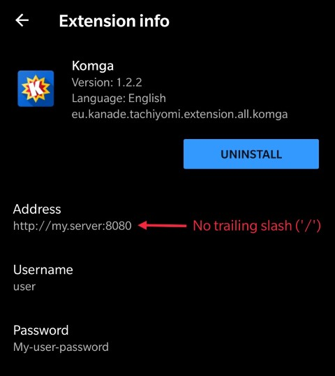

[](https://travis-ci.com/gotson/komga)
[](https://github.com/gotson/komga/releases)
[](https://hub.docker.com/r/gotson/komga)

#  Komga

Komga is a free and open source comics/mangas server.

## Features

Features include:

- scan and index libraries (local folders) containing sub-folders with comic book archives in `cbz` and `cbr` format, as well as `pdf`. Rescan periodically.
- serve the individual pages of those books via an API
- serve the complete file via an API
- provide OPDS feed

## Status & vision

For now Komga is a simple server without user interface, providing an API and OPDS feed. It can work with [Tachiyomi](https://github.com/inorichi/tachiyomi) through the official extension, as well as most OPDS readers.

The long term vision is to offer something similar to Plex, but for comics!

## Installation

### Docker

The easiest way to run Komga is via Docker. Please refer to the ([instructions on how to use the image](https://hub.docker.com/r/gotson/komga)).

### Jar file

Alternatively you can run it from the fat `jar` file. You can find them in the [releases](https://github.com/gotson/komga/releases) section.

In order to run Komga, use the following command:

```
java -jar komga-x.y.z.jar
```

Note that you **need** to have a valid `application.yml` configuration file (or environment variables) for Komga to run properly, read on to the next section to find out more.

## Configuration

Komga relies heavily on [Spring Boot's configuration](https://docs.spring.io/spring-boot/docs/current/reference/html/boot-features-external-config.html), leveraging `profiles` and configuration `properties`.

The easiest way to configure is either via environment variables (a good fit for `docker-compose`) or by using an `application.yml` file located in the same folder as the `jar` file.

You can check sample `application.yml` files for [Windows](./doc/sample-configuration/windows/application.yml) and [Unix/Linux](./doc/sample-configuration/unix/application.yml).

Each configuration key can have a different format depending if it's from the environment variable, or from the `application.yml` file. In the following section I will provide both format in the form `ENVIRONMENT_VARIABLE` / `application-property`.

### Mandatory configuration

In order to make Komga run, you need to specify some mandatory configuration keys (unless you use Docker, in which case defaults are setup):

- `SPRING_PROFILES_ACTIVE` / `spring.profiles.active`: `prod` - this will enable the database management and upgrades for new versions.
- `SPRING_DATASOURCE_URL` / `spring.datasource.url`: the path of the database file. For Docker I use `jdbc:h2:/config/database.h2;DB_CLOSE_DELAY=-1`, where `/config/database.h2` is the actual file inside the docker container. You can customize this part if running without docker.
- `KOMGA_LIBRARIES_SCAN_CRON` / `komga.libraries-scan-cron`: a [Spring cron expression](https://docs.spring.io/spring/docs/current/javadoc-api/org/springframework/scheduling/support/CronSequenceGenerator.html) for libraries periodic rescans. `0 0 * * * ?` will rescan every hour. `0 */15 * * * ?` will rescan every 15 minutes.

### Optional configuration

You can also use some optional configuration keys:

- `KOMGA_USER_PASSWORD` / `komga.user-password`: the password for the user `user`. Defaults to `user`.
- `KOMGA_ADMIN_PASSWORD` / `komga.admin-password`: the password for the user `admin`. Defaults to `admin`.
- `KOMGA_THREADS_PARSE` / `komga.threads.parse`: the number of worker threads used for book parsing. Defaults to `2`. You can experiment to get better performance.
- `KOMGA_LIBRARIES_SCAN_DIRECTORY_EXCLUSIONS` / `komga.libraries-scan-directory-exclusions`: a list of patterns to exclude directories from the scan. If the full path contains any of the patterns, the directory will be ignored. If using the environment variable form use a comma-separated list. 

## What does it do?

Komga will scan your libraries for directories containing supported files (at the moment `cbz`, `zip`, `cbr`, `rar` and `pdf`):

- each folder containing comic books will be made as a `Series`
- each comic book file inside a `Series` will be made as a `Book`

It works with sub-folders too, so if you have a structure like this:

```
Comics/
├── Private Eye/
│   ├── Volume 1.cbz
│   └── Volume 2.cbz
└── One Shot.cbz
```

Komga will generate:

- a `Series` called _Comics_, containing a `Book` called _One Shot_
- a `Series` called _Private Eye_, containing two `Book`s called _Volume 1_ and _Volume 2_

On rescans, Komga will update Series and Books, add new ones, and remove the ones for which files don't exist anymore.

Then it will _parse_ each book, which consist of indexing pages (images in the archive), and generating a thumbnail.

## Clients

### Tachiyomi

Komga has an official extension for [Tachiyomi](https://github.com/inorichi/tachiyomi), available from within Tachiyomi's extension menu.
The extension is configurable, you need to specify the `server address`, `username`, and `password`.



### OPDS readers

Komga works with most of the OPDS readers on Android/iOS.

Tested readers:

- Android
  - :white_check_mark: [FBReader: Favorite Book Reader](https://play.google.com/store/apps/details?id=org.geometerplus.zlibrary.ui.android)
  - :x: [Moon+ reader](https://play.google.com/store/apps/details?id=com.flyersoft.moonreader) - Authentication is not working

- iOS
  - :white_check_mark: [KyBook 3](http://kybook-reader.com/)

## APIs

### Native API

Komga offers a REST API, which you can browse using Swagger. It's available at `/swagger-ui.html`. The API offers __file download__ and __page streaming__.

In order to access the API, you will need to authenticate using Basic Authentication, with one of the 2 built-in users (`admin` or `user`).

### OPDS

Komga offers a standard OPDS feed, it is available at `/opds/v1.2/catalog`.

The OPDS feed also supports:

- OpenSearch functionality, to search by `Series`
- [OPDS Page Streaming Extension 1.0](https://vaemendis.net/opds-pse/) 

## Credits

The Komga icon is based on an icon made by [Freepik](https://www.freepik.com/home) from www.flaticon.com
